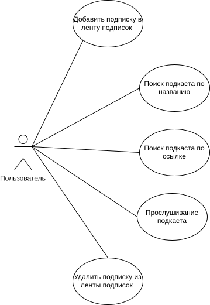
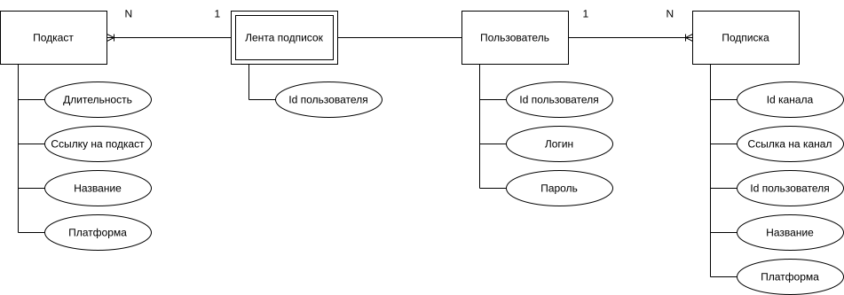
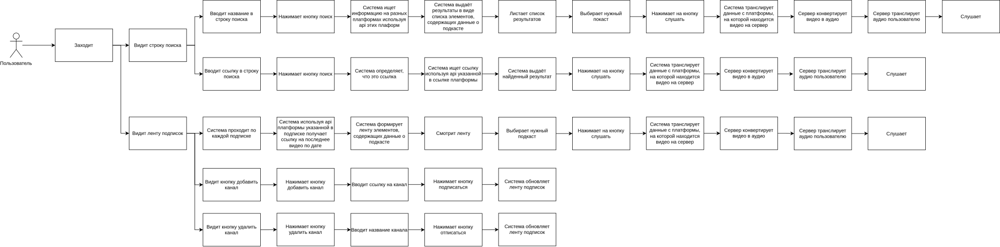

# Название проекта
### PodCast

# Краткое описание идеи проекта
Web-приложение с возможностью слушать все видео с видео-платформ с YouTube и Rutube в формате подкастов. Пользователь имеет возможность указать ссылку или название для прослушивания подкаста, добавить подписку в ленту подписок.

# Краткое описание предметной области
Предметной областью является агрегация контента и преобразование видео в аудио-формат. Агрегация контента заключается в сборе и организации видео с YouTube и Rutube на одной платформе. Преобразование видео в аудио-формат удаляет визуальную составляющую и позволяет пользователям сосредотачиваться только на звуке.

# Краткое обоснование целесообразности и актуальности проекта
Подкасты становятся всё более популярными, так как позволяют потреблять контент в фоновом режиме. К тому же аудио-формат позволяет пользователям экономить время, так как они могут заниматься другими делами одновременно. Видео-контент часто содержит визуальные элементы, которые могут отвлекать. Аудио-формат помогает сосредоточиться на сути контента. Данный проект позволит убрать всё ненужное и оставить только важный для пользователя контент.

# Краткое описание акторов
Гость может:
* авторизовываться.

Пользователь может:
* выйти из аккаунта;
* искать подкаст по названию;
* искать подкаст по ссылке;
* слушать подкаст;
* добавлять/удалять подписки по ссылке в/из ленты подписок;
* просматривать ленту подписок.

# Use-Case

# ER-диаграмма сущностей

# Пользовательские сценарии
