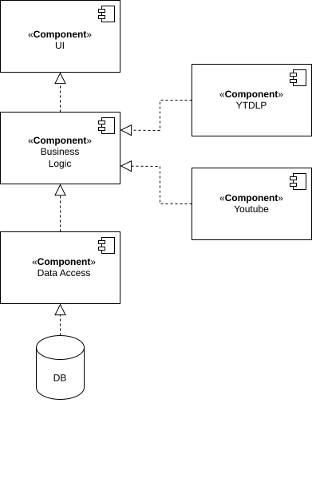
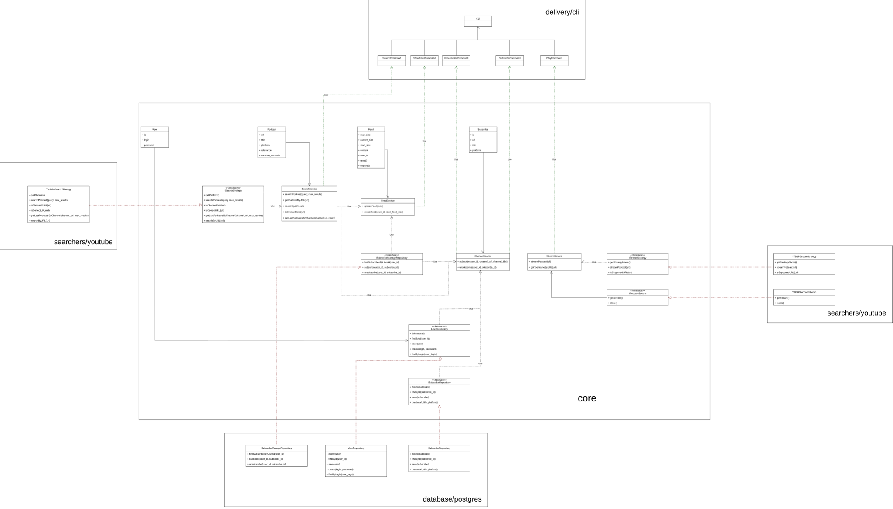

# Название проекта
### PodCast

# Краткое описание идеи проекта
Web-приложение с возможностью слушать все видео с видео-платформ с YouTube и Rutube в формате подкастов. Пользователь имеет возможность указать ссылку или название для прослушивания подкаста, добавить подписку в ленту подписок.

# Краткое описание предметной области
Предметной областью является агрегация контента и преобразование видео в аудио-формат. Агрегация контента заключается в сборе и организации видео с YouTube и Rutube на одной платформе. Преобразование видео в аудио-формат удаляет визуальную составляющую и позволяет пользователям сосредотачиваться только на звуке.

# Краткое обоснование целесообразности и актуальности проекта
Подкасты становятся всё более популярными, так как позволяют потреблять контент в фоновом режиме. К тому же аудио-формат позволяет пользователям экономить время, так как они могут заниматься другими делами одновременно. Видео-контент часто содержит визуальные элементы, которые могут отвлекать. Аудио-формат помогает сосредоточиться на сути контента. Данный проект позволит убрать всё ненужное и оставить только важный для пользователя контент.

# Краткое описание акторов
Гость может:
* авторизовываться.

Пользователь может:
* выйти из аккаунта;
* искать подкаст по названию;
* искать подкаст по ссылке;
* слушать подкаст;
* добавлять/удалять подписки по ссылке в/из ленты подписок;
* просматривать ленту подписок.

# Use-Case

# ER-диаграмма сущностей

# Пользовательские сценарии

# Описание типа приложения и выбранного технологического стека
Приложение типа Web SPA. Технологический стек: TypeScript, Svelte, Deno, PostgreSQL.

# Верхнеуровневое разбиение на компоненты

# UML диаграммы классов компонентов доступа к данным и бизнес-логики

# Экраны будущего web-приложения
https://www.figma.com/design/RUGsfMmNQZkCmmQQlHkIwU/Podcast?node-id=5-335&t=NcPQqLXYSKVOtlra-1

# Портреты пользователей
### Случайный слушатель
Цель: быстро найти интересный подкаст и послушать.
Поведение:
* часто ищет что-то новое
* редко подписывается
* слушает по одной-две записи

Сценарий: Найти и послушать подкаст
1. Пользователь открывает сайт.
2. Вводит тему в поиск.
3. Выбирает интересный выпуск.
4. Нажимает прослушать.
5. При необходимости перематывает.

### Подписчик
Цель: следить за любимыми каналами.
Поведение:
* активно подписывается
* слушает новые выпуски из ленты
* редко пользуется поиском

Сценарий: Послушать новые выпуски в ленте
1. Открывает сайт.
2. Обновляет ленту подписок.
3. Видит новые выпуски.
4. Нажимает на один из них.
5. Слушает.

Сценарий: Подписаться на канал
1. Заходит в меню подписок.
2. Нажимает «Подписаться».
3. Выпуски этого канала появляются в ленте.

### Исследователь
Цель: искать новые темы, авторов, форматы.
Поведение:
* активно использует поиск
* подписывается редко, больше пробует всё подряд

Сценарий: Найти новые подкасты по интересам
1. Открывает сайт.
2. Вводит тему или ключевые слова.
3. Перелистывает результаты поиска.
4. Прослушивает фрагмент/начало выпуска.
5. Идёт дальше, не подписываясь.

# Moodboard
https://ru.pinterest.com/hotcat8292/%D0%BF%D0%BE%D0%B4%D0%BA%D0%B0%D1%81%D1%82-ui/

# Стили
https://www.figma.com/design/RUGsfMmNQZkCmmQQlHkIwU/Podcast?node-id=114-2&p=f&t=7ClGgyev3X5ydLXm-0

# Макет версия 2
https://www.figma.com/design/RUGsfMmNQZkCmmQQlHkIwU/Podcast?node-id=122-117&t=7ClGgyev3X5ydLXm-0
